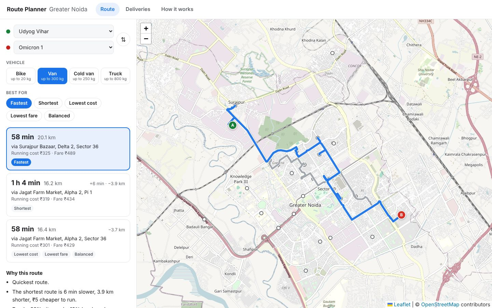

# Logistics Route Optimization System

Route planner for deliveries in Greater Noida. AI course project (CCSAI0301), Group 101, BTech CSE-F, NIET Greater Noida.

**Live demo:** https://utk042.github.io/AI_PBL/



## What it does

**Route.** Pick a start, a destination and a vehicle (bike, van, cold van or truck). The app shows the route on the map and lets you choose what matters most:

- **Fastest**: least travel time in peak traffic
- **Shortest**: fewest kilometres
- **Lowest cost**: fuel plus driver time
- **Lowest fare**: what the customer would pay
- **Balanced**: a mix of time, distance and cost

It also shows alternative routes and says why a route was picked: how it compares with the other options, what roads it uses, and whether a vehicle rule changed it (trucks are not allowed in narrow market lanes).

**Deliveries.** Plans a day of 12 orders for 4 vehicles from the Knowledge Park II depot. Each order goes to a vehicle that is allowed to carry it, without going over capacity, and arrives inside the customer's time window. For every stop you can open "Why this vehicle?" to see the reason.

**How it works.** Shows the AI techniques behind the app for the course review: the search algorithms compared on the map, the classic problems (Water-Jug, N-Queens, TSP, Missionaries and Cannibals, 8-puzzle), propositional and first-order logic, the semantic network, frames and the expert system.

## The data

26 real places in Greater Noida (sectors, markets, universities, the depot) and 49 roads between them. Place positions and road shapes come from OpenStreetMap; distances are real driving distances from the OSRM routing service. Travel times use OSRM's time multiplied by a peak-traffic factor for the road type. `scripts/build-network.py` rebuilds the data file.

The orders, vehicles, fuel use and fare rates are sample values we chose.

## How the planning works

| Step | What happens | Syllabus |
|---|---|---|
| Road graph | Places are nodes, roads are weighted edges (km, minutes) | Module 1 |
| Route options | A* search with a different cost for each option; the straight-line distance gives a lower bound so A* stays exact | Module 1 |
| Alternatives | Yen's algorithm: re-run A* with parts of the best route blocked | Module 1 |
| Vehicle rules | Expert system decides which vehicle types may carry an order (perishable needs a cold van, bulk needs a truck, trucks can't enter narrow lanes...) | Module 3 |
| Knowledge | Vehicle types as frames and a semantic network (cold van *is a* van *is a* vehicle); feasibility as first-order logic rules | Module 3 |
| Assigning orders | Constraint satisfaction: capacity and time windows; every valid plan is checked and the one with least driving is kept | Module 1 |
| Stop order | Travelling salesperson with time windows for each vehicle | Module 2 |

## Results

From `npm run benchmark` on the current data:

| Plan | Distance | Late deliveries | Over capacity | Rule broken |
|---|---:|---:|---:|---:|
| Orders handed out in turn, BFS routes | 136.3 km | 0 | 1 | 6 |
| Orders handed out in turn, DFS routes | 274.5 km | 2 | 1 | 6 |
| **Our planner (A* + rules + CSP + TSP)** | **99.5 km** | **0** | **0** | **0** |

- 27% less driving than the simple plan, with no broken rules.
- Across all 650 pairs of places, A* always found the best route and checked 45% fewer places than uniform cost search.

## Run it

No build step. Any static file server works:

```bash
git clone https://github.com/utk042/AI_PBL.git
cd AI_PBL
python -m http.server 8080
# open http://localhost:8080
```

```bash
npm test            # 24 tests
npm run benchmark   # numbers above
```

The map needs an internet connection for the map tiles. Without one, the app draws a plain road outline instead.

## Code layout

```
index.html, css/        page and styles
js/data/                roads.js (generated from OpenStreetMap), orders and vehicles
js/core/                graph, search algorithms, CSP, TSP, route options
js/kr/                  logic, semantic network, frames, expert system and its rules
js/problems/            Water-Jug, N-Queens, Missionaries-Cannibals, 8-puzzle
js/planner.js           delivery planning
js/ui/                  screens
tests/, scripts/        tests, benchmark, data builder
```

## Progress

| Review | Progress | Covered |
|---|---|---|
| Review 1 | 30% | Problem study, Modules 1 and 2 concepts, literature |
| **Review 2** | **50%** | Working app: search, CSP, TSP, Module 2 problems, Module 3 knowledge base and expert system |
| Final | 100% | Module 4 (Bayesian traffic model, fuzzy urgency, certainty factors), bigger network, re-routing, final report |

## Team

| Name | Roll no. | Worked on |
|---|---|---|
| Utkarsh Raj Shukla | 2501330100398 | Road graph, uninformed search, Water-Jug, Missionaries-Cannibals, integration |
| Vivek Kumar | 2501330100414 | A*, greedy search, heuristics, 8-puzzle, TSP |
| Vishal Gupta | 2501330100411 | CSP solver, N-Queens, propositional and first-order logic |
| Yash Srivastava | 2501330100422 | Multi-vehicle planning, semantic network, frames, benchmarks |
| Nishant Kumar Mahto | 0261DCS009 | Interface, map, expert-system screen |

## References

1. Yen, J. Y. (1971). Finding the k shortest loopless paths in a network. *Management Science*, 17(11), 712–716.
2. Liu, X., Chen, Y.-L., Por, L. Y., & Ku, C. S. (2023). A systematic literature review of vehicle routing problems with time windows. *Sustainability*, 15(15), 12004.
3. Zhou, F., et al. (2025). Learning for routing: A guided review of recent developments and future directions. *Transportation Research Part E*, 202, 104278.

Map data © OpenStreetMap contributors.
