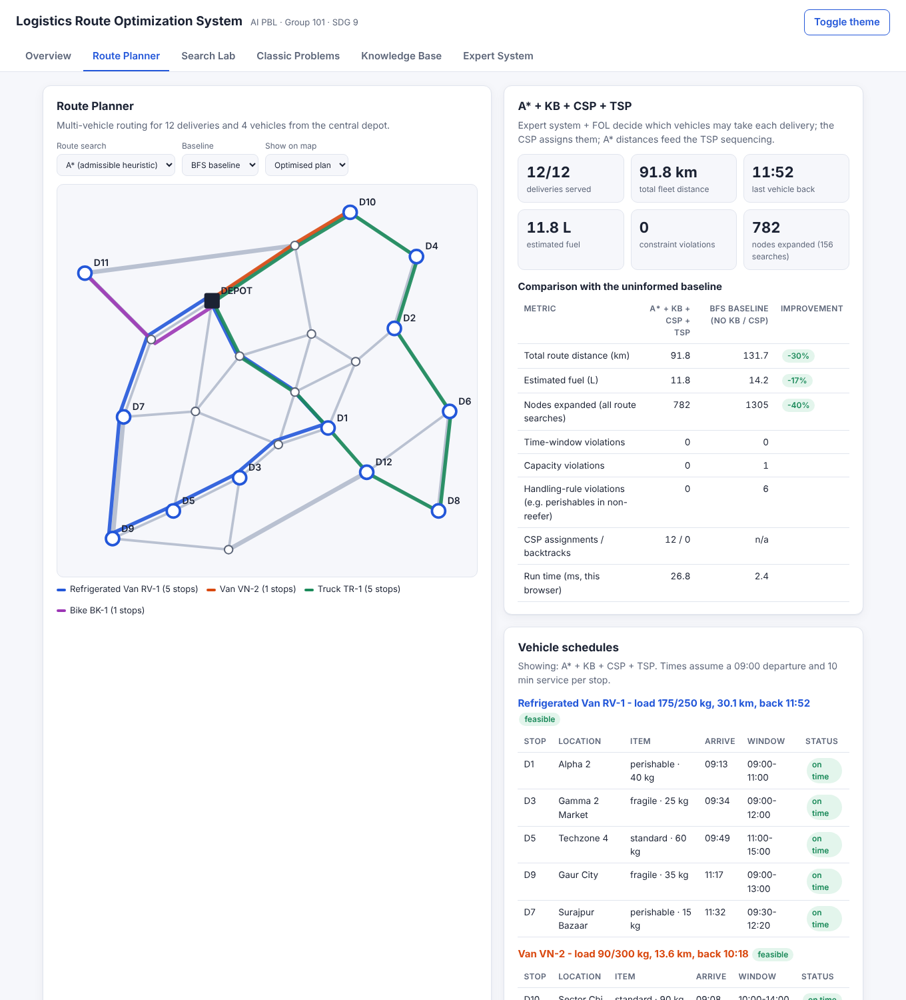

# Logistics Route Optimization System

AI Project-Based Learning (PBL) · Course **CCSAI0301 Artificial Intelligence** · BTech CSE-F · NIET Greater Noida
Faculty: **Dr. Mohd. Nazim** · Group **101** · SDG 9: Industry, Innovation & Infrastructure

An AI system that plans delivery routes for a mixed fleet (refrigerated van, van, truck, bike) across a
city road network. It minimises distance, time and fuel while respecting vehicle capacity, customer
time windows and handling rules such as "perishables need a refrigerated van".

**Live demo:** https://utk042.github.io/AI_PBL/

**Current progress: 50% (Review 2).**



## How the AI pipeline works

| Stage | What happens | Syllabus |
|---|---|---|
| 1. Road graph | Junctions = vertices, roads = weighted edges (distance km, time min) in an adjacency list | Module 1 |
| 2. Frames + semantic network | Vehicle and delivery knowledge with defaults, demons and is-a inheritance | Module 3 |
| 3. Expert system | Dispatch Advisor rules decide which vehicle classes may carry each delivery | Module 3 |
| 4. First-order logic | `Feasible(?v, ?d) <= Permitted & CanCarry & Reachable` derived for all pairs | Module 3 |
| 5. CSP | Deliveries → vehicles with capacity and time-window constraints (MRV + forward checking) | Module 1 |
| 6. A* distance matrix | Shortest road path between every pair of stops, admissible straight-line heuristic | Module 1 |
| 7. TSP with time windows | Orders each vehicle's stops (exact branch-and-bound / Held-Karp, NN + 2-opt) | Module 2 |

## Features in the web app

- **Route Planner** - multi-vehicle plan on the map, per-vehicle schedules, comparison with BFS/DFS baselines.
- **Search Lab** - BFS, DFS, Iterative Deepening, Bi-directional, Uniform Cost, Greedy Best-First and A* side by side, with expanded junctions highlighted.
- **Classic Problems** (Module 2) - Water-Jug, N-Queens (CSP), Travelling Salesperson, Missionaries & Cannibals, 8-puzzle (tiles) - all solved by the same engine.
- **Knowledge Base** (Module 3) - propositional logic (truth tables, entailment, forward/backward chaining), first-order logic (unification, rule chaining, ∀∃ checks), semantic network and frames.
- **Expert System** (Module 3) - Dispatch Advisor showing the full architecture: knowledge base, working memory, inference engine (match-resolve-act trace), explanation facility (HOW / WHY) and backward chaining.

## Results (sample dataset: 22 junctions, 37 roads, 12 deliveries, 4 vehicles)

Run `npm run benchmark` to reproduce.

| Method | Distance (km) | Fuel (L) | Nodes expanded | Time-window viol. | Capacity viol. | Handling-rule viol. |
|---|---:|---:|---:|---:|---:|---:|
| DFS baseline (no KB / CSP) | 372.9 | 42.7 | 1870 | 1 | 1 | 6 |
| BFS baseline (no KB / CSP) | 131.7 | 14.2 | 1305 | 0 | 1 | 6 |
| Uniform Cost + KB + CSP + TSP | 91.8 | 11.8 | 1931 | 0 | 0 | 0 |
| **A\* + KB + CSP + TSP** | **91.8** | **11.8** | **782** | **0** | **0** | **0** |

- The optimised plan is **30% shorter** than the BFS baseline and **75% shorter** than DFS, with zero violations.
- A* returns the optimal route for **462 / 462** junction pairs while expanding **60% fewer** nodes than Uniform Cost.
- On the 8-puzzle, A* with Manhattan distance expands ~394 states vs ~20,000 for BFS for the same 18-move optimal solution.

## Run locally

No build step and no dependencies - plain HTML, CSS and JavaScript (ES modules).

```bash
git clone https://github.com/utk042/AI_PBL.git
cd AI_PBL
python -m http.server 8080        # or: npm start
# open http://localhost:8080
```

```bash
npm test             # 20 unit tests (search, CSP, TSP, logic, frames, expert system, planner)
npm run benchmark    # numbers used in the progress report
```

## Project structure

```
index.html              web app shell
css/style.css           styles (light and dark theme)
js/data/network.js      road network, deliveries and fleet (Month 2 dataset)
js/core/                graph, search algorithms, priority queue, CSP solver, TSP solvers
js/problems/            Water-Jug, N-Queens, Missionaries-Cannibals, 8-puzzle
js/kr/                  propositional logic, FOL, semantic network, frames, expert system + rules
js/planner.js           integrated planning pipeline and baseline
js/ui/                  views for each tab
tests/run-tests.js      unit tests
scripts/benchmark.js    benchmark script
docs/                   progress notes and screenshots
```

## Progress

| Review | Progress | Scope |
|---|---|---|
| Review 1 (Month 1) | 30% | Problem understanding, requirements, Module 1 & 2 concept study, literature review |
| **Review 2 (Month 2)** | **50%** | Working prototype: search, CSP, TSP, Module 2 problems, Module 3 knowledge representation and expert system |
| Final review | 100% | Module 4 statistical reasoning, real map data, dynamic re-routing, final benchmarking and report |

See [docs/PROGRESS.md](docs/PROGRESS.md) for the detailed plan.

## Team - Group 101

| Member | Roll No. | Month 2 work |
|---|---|---|
| Utkarsh Raj Shukla | 2501330100398 | Road graph, uninformed search, Water-Jug & Missionaries-Cannibals, integration, repository |
| Vivek Kumar | 2501330100414 | A* / Greedy, heuristics, 8-puzzle, TSP solvers |
| Vishal Gupta | 2501330100411 | CSP solver, N-Queens, propositional & first-order logic knowledge base |
| Yash Srivastava | 2501330100422 | Multi-vehicle extension, semantic network & frames, benchmarking |
| Nishant Kumar Mahto | 0261DCS009 | UI & route visualisation, expert-system interface |

## References

1. Russell, S., & Norvig, P. *Artificial Intelligence: A Modern Approach* (4th ed.). Pearson.
2. Rich, E., Knight, K., & Nair, S. B. *Artificial Intelligence* (3rd ed.). McGraw Hill.
3. Liu, X., Chen, Y.-L., Por, L. Y., & Ku, C. S. (2023). A systematic literature review of vehicle routing problems with time windows. *Sustainability*, 15(15), 12004. https://doi.org/10.3390/su151512004
4. Zhou, F., Lischka, A., Kulcsár, B., Wu, J., Chehreghani, M. H., & Laporte, G. (2025). Learning for routing: A guided review of recent developments and future directions. *Transportation Research Part E*, 202, 104278. https://doi.org/10.1016/j.tre.2025.104278
